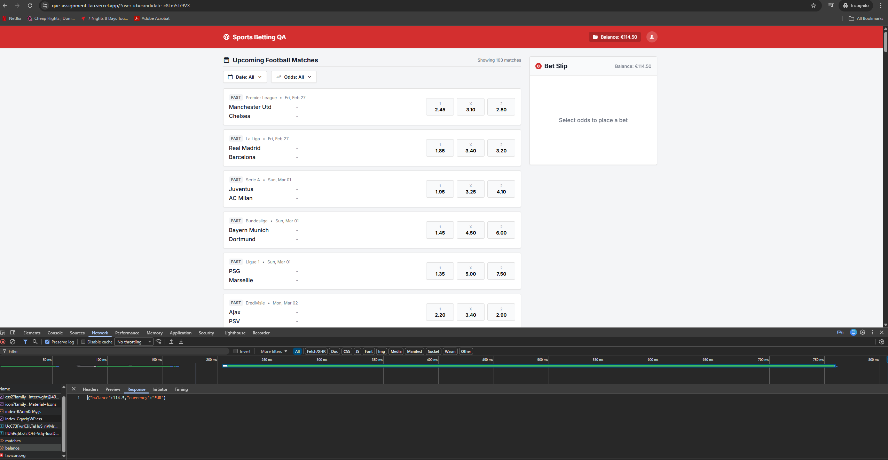
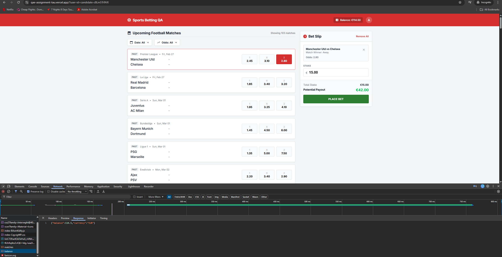
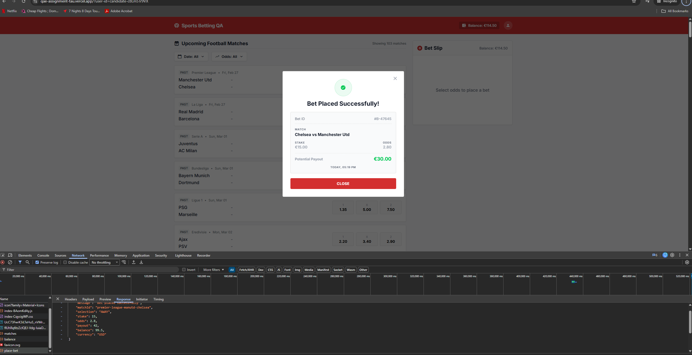
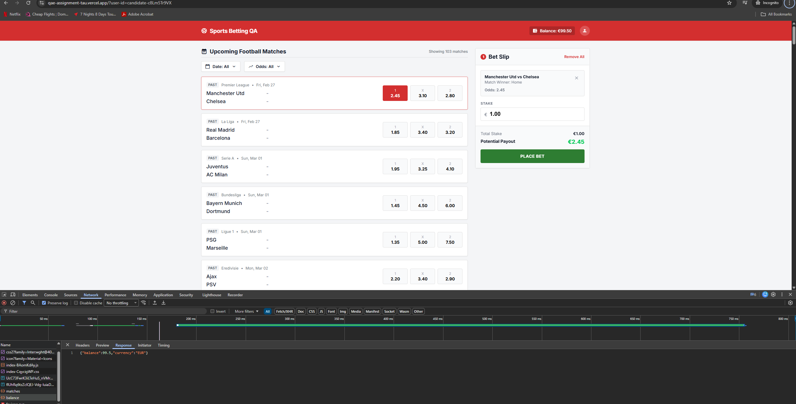
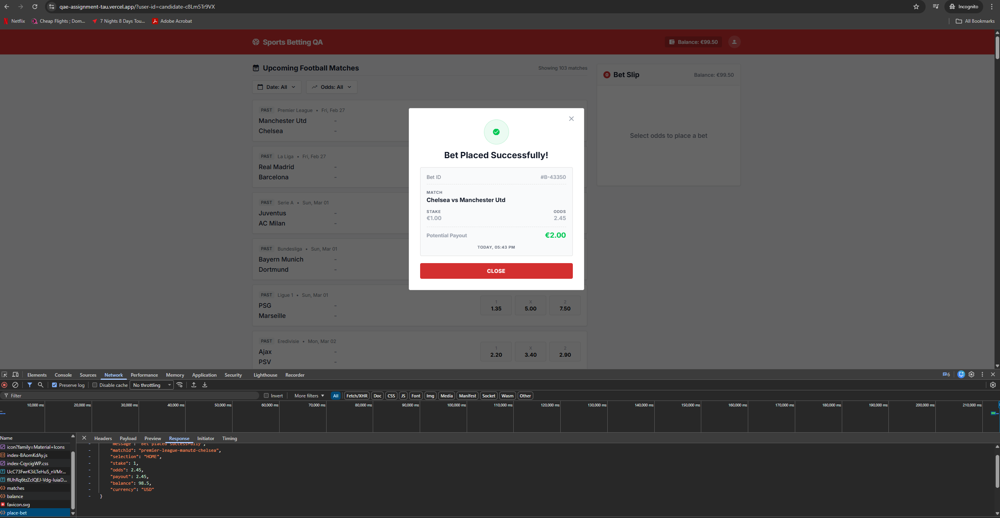
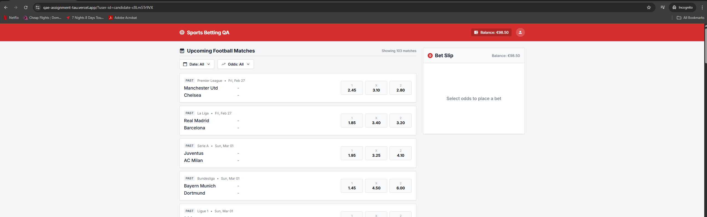
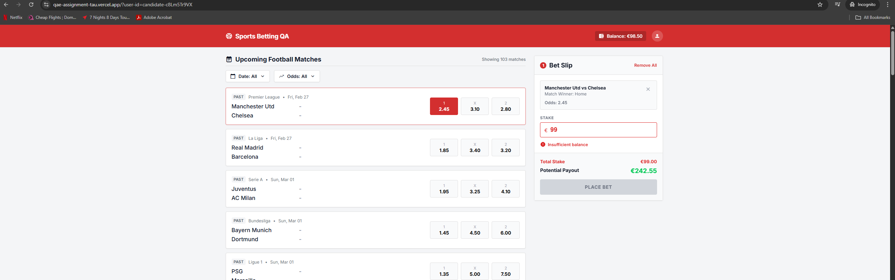
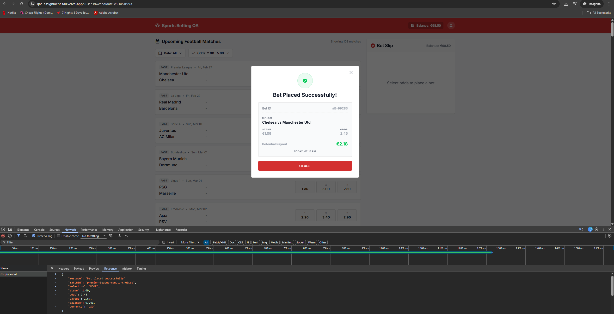
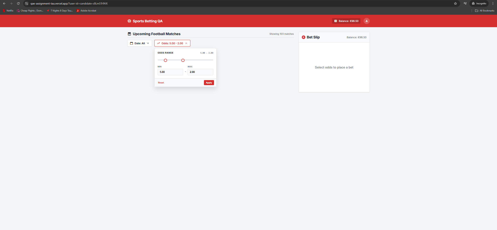
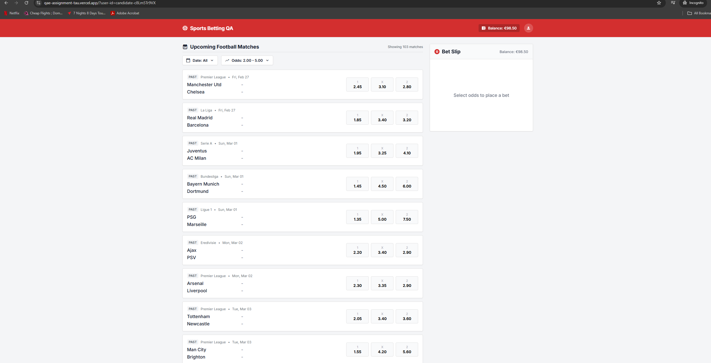

# Part A: Execution Results & Defect Reports

## Execution Summary
* **Executed Scenarios:** TC-01, TC-02, TC-04
* **Environment:** Desktop Chrome (Latest, Incognito)
* **Test User ID:** `candidate-c8Lm5Tr9VX`

---

## Execution Logs

### Scenario: TC-01 (Degraded Happy Path - E2E Bet Placement)
* **Status:** Passed (with critical UI/API caveats logged in bugs)
* **Execution Note:** Execution revealed massive architectural and frontend state bugs, including a hardcoded payout calculation (BUG-005), reversed domain logic (BUG-006), missing API identifiers (BUG-004), UI state desync (BUG-002), and an API currency mismatch (BUG-003).
* **Step-by-Step Evidence:**
  1. **Initial State:** User authenticated, balance verified.
     * 
  2. **Selection & Input:** Odds clicked, Bet Slip populated, and valid stake of €15.00 entered.
     * 
  3. **Submission:** Bet placed. Receipt generated, but exposes math/ordering defects and API contract failures.
     * 

### Scenario: TC-02 (Minimum Stake Enforcement - Requirements Conflict)
* **Status:** Passed 
* **Execution Note:** Wager of exactly €1.00 accepted successfully (`200 OK`), verifying the system correctly enforces the €1.00 minimum boundary (logging documentation discrepancy as BUG-001).
* **Step-by-Step Evidence:**
  1. **Boundary Input:** Stake set to absolute minimum (€1.00).
     * 
  2. **Validation:** System successfully accepts the boundary value.
     * 

### Scenario: TC-04 (Insufficient Funds Block - Validation Overlap)
* **Status:** Passed
* **Execution Note:** To avoid the €100 Max Stake validation masking the Insufficient Funds validation, the balance was intentionally reduced below €100.00 first. A wager of €99.00 was then attempted against a balance of €98.50. Successfully blocked without making a backend API call, proving client-side enforcement.
* **Step-by-Step Evidence:**
  1. **Precondition Setup:** Wallet deliberately drained below the €100.00 max stake threshold to €98.50.
     * 
  2. **Risk Input & System Defense:** Stake entered exactly €0.50 above available balance (€99.00) and the UI correctly blocks the transaction with an "Insufficient balance" warning.
     * 

---

## Defect Reports

### BUG-001: Documentation Defect - Conflicting Minimum Stake Requirements
* **Severity:** Low (Documentation / Requirements)
* **Reproduction Steps:** Review Spec Sec 3 ("Stake min €1.00") vs Sec 4.1 ("Stake Minimum €1.01"). Execute €1.00 bet.
* **Expected vs Actual:** The documentation contradicts itself. System accepts €1.00 (`200 OK`), aligning with Sec 3 but violating Sec 4.1.
* **Impact:** Misaligned test automation and developer confusion. Update Sec 4.1 to `>= €1.00`.

### BUG-002: UI State Desync - Balance fails to update dynamically after successful bet
* **Severity:** High
* **Reproduction Steps:** Place a valid wager. Close the success receipt. Observe header balance.
* **Expected vs Actual:** UI balance should update dynamically based on the API response. Actual balance remains stale until a hard page refresh.
* **Impact:** Erodes user trust. May lead to false "Insufficient Funds" attempts.
* **Evidence:** 

### BUG-003: API Contract Violation - Returns incorrect currency code (USD)
### BUG-003: API Contract Violation - Returns incorrect currency code (USD)
* **Severity:** Medium
* **Reproduction Steps:** Inspect JSON response payload for `POST /api/place-bet`.
* **Expected vs Actual:** Expected `"currency": "EUR"` per Spec Sec 5.3. Actual is `"currency": "USD"`.
* **Impact:** Corrupts downstream financial data warehouses and future multi-currency integrations.
* **Evidence:** 

### BUG-004: Architectural Gap - API missing 'Bet ID' and 'Timestamp'
* **Severity:** High
* **Reproduction Steps:** Inspect JSON response payload for `POST /api/place-bet`. Compare to UI Spec Sec 2.4.
* **Expected vs Actual:** Backend must return server-generated `betId` and `timestamp`. Actual payload omits these entirely.
* **Impact:** Critical auditability failure. Frontend is forced to fake receipt data locally, violating compliance.
* **Evidence:** 

### BUG-005: Critical Math Defect - Incorrect Potential Payout calculated on receipt
* **Severity:** Critical
* **Reproduction Steps:** Place a wager (e.g., €1.00 at 2.45 odds). Observe receipt "Potential Payout".
* **Expected vs Actual:** Expected math is `stake × odds` (€2.45). Actual UI displays a corrupted calculation. Note: API calculates it correctly, proving a frontend rendering bug.
* **Impact:** Catastrophic loss of user trust. Users believe they are being shortchanged.
* **Evidence:** 

### BUG-006: Domain Logic Violation - Team ordering reversed on Bet Receipt
* **Severity:** High
* **Reproduction Steps:** Place a bet on Real Madrid (Home) vs Barcelona (Away).
* **Expected vs Actual:** Home team must be listed first. Actual receipt reverses it to "Barcelona vs Real Madrid".
* **Impact:** Confuses bettors regarding their wager's core configuration.
* **Evidence:** 

### BUG-007: Scope Violation - Match list displays "PAST" events
* **Severity:** Medium
* **Reproduction Steps:** Observe match list tags on dashboard.
* **Expected vs Actual:** Spec mandates "Upcoming/Pre-match events only". Actual matches are explicitly tagged "PAST".
* **Impact:** Opens platform to known-outcome fraud or broken backend rejections.

### BUG-008: UI Omission - Kickoff time missing from match list
* **Severity:** Low
* **Reproduction Steps:** Observe date label above matches.
* **Expected vs Actual:** Spec Sec 2.1 mandates "kickoff date/time label". Actual UI displays date only.

### BUG-009: Missing Validation - Odds Filter accepts illogical ranges (Min > Max)
* **Severity:** Medium
* **Reproduction Steps:** Enter `5.00` in Min, `2.00` in Max. Click Apply.
* **Expected vs Actual:** UI should block or auto-swap. Actual system accepts it, resulting in a blank list due to impossible math (`odds >= 5.00 AND odds <= 2.00`).
* **Evidence:** 

### BUG-010: UI State Desync - "Showing X matches" counter static
* **Severity:** Low
* **Reproduction Steps:** Apply any filter that reduces match count.
* **Expected vs Actual:** Counter should reflect visible array length. Actual counter remains locked at "Showing 103 matches".
* **Evidence:** 

### BUG-011: Flawed Filter UX - Out-of-range odds remain active on partial matches
* **Severity:** Medium
* **Reproduction Steps:** Filter for `2.00 - 5.00`. Observe mixed-odds matches (e.g., Bayern Munich).
* **Expected vs Actual:** Out-of-range odds (e.g., 1.45, 6.00) should be disabled. Actual filter works at the match-level, leaving invalid odds fully clickable.
* **Impact:** Frustrates bettors attempting to use strict mathematical strategies.
* **Evidence:** 